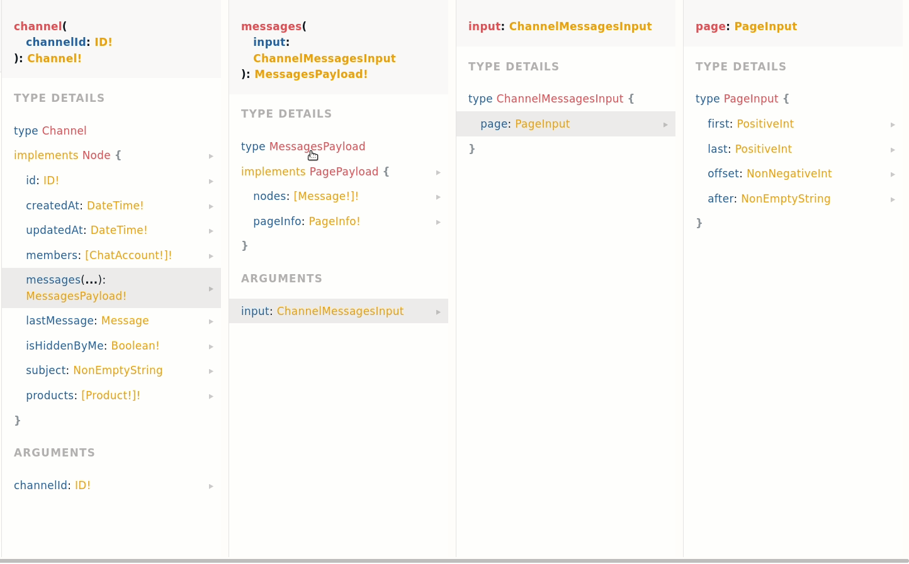

# Manufactured - Back-end test

Welcome to the technical test for back-end developers. For this test, you'll need to make a simple HTTP server that aggregates data fetched from our GraphQL API. Make sure to read all the way to the end before starting.

## Requirements

- Make a private repo on Github
- Use TypeScript or JavaScript, ideally TypeScript. Other than that you can freely choose which libraries you use
- Create a server that handles a single route. If using REST then `GET /stats`, otherwise if GraphQL then `query stats() { ... }`
- The endpoint must run the query described below in `Query` and output the response described in `Response`
- Include a `README.md` that describes the steps needed to run your project and anything you might like to clarify
- You are done! invite [flesler](https://github.com/flesler/) to the repo for reviewing and email your point of contact

### Response

The endpoint should respond with a payload similar to this, based on messages' text (more on that below). The provided values are all realistic but fake:

```
{
  "messages": 88,
  "queries": 5,
  "responseTimes": {
    "min": 1500,
    "avg": 5000,
    "max": 80000
  },
  "characters": {
    "min": 20,
    "avg": 400,
    "max": 3000
  },
  "words": {
    "min": 3,
    "avg": 15,
    "max": 200
  },
  "numbers": {
    "min": 0,
    "avg": 1,
    "max": 4
  }
}
```

`queries` should count how many queries were performed to the GraphQL API for this request. `responseTimes` should be calculated as the difference in milliseconds between each `Message`'s `createdAt` and the next one. `numbers` should count the amount of sequential numbers in the text. In all cases `min` should have the minimum value across all messages, `avg` the average and `max` the maximum. The rest should be self-explanatory.

### Query

You need to hit the GraphQL API at https://dev.gql.manufactured.com/graphql. You can use any tool, we provide a very simple example using [graphql-request](https://www.npmjs.com/package/graphql-request) you are free to use it & extend it or to use something else entirely. You can try it with `npm start`.

The example script includes a basic query to get a single page of messages. It has a valid authentication token, the `$channelId` you should use with it and a `$pageSize` of 20. You'll load messages in batches of 20 so you'll need to implement pagination by extending the given code at least a bit. You can either use offset-based pagination by passing an `input.page.offset` or cursor-based by passing a cursor in `input.page.after`. You should rely on the `text` property of each `Message` to calculate the stats described below.

You can check the docs for the query by going to https://dev.gql.manufactured.com/graphql and clicking `DOCS` on the right side. The first query (`channel`) is the one you need. Here's a GIF to hopefully save you some time:




## Bonus points

You'll get bonus points the more you include from the following list:

- In your repo, write in what way would you improve, optimize and/or harden your server (textual, no need to code)
- Do not count as `numbers` things like times, dates, product versions, etc. Only count actual numbers (1 or many digits)
- If you have used offset-based pagination, instead use cursor-based pagination
- Add `emojis` (with `min`, `avg`, `max`) to the response, counting the number of emojis in messages
- Add `verbs` (with `min`, `avg`, `max`) to the response, counting the number of verbs in messages
- Add `nouns` (with `min`, `avg`, `max`) to the response, counting the number of nouns in messages
- Strongly type your query by using a tool like [GraphQL code generator](https://www.graphql-code-generator.com/) with [typescript-graphql-request](https://www.graphql-code-generator.com/docs/plugins/typescript-graphql-request).

## Final Notes

If you have any questions or something in the API is not working as expected, feel free to consult us via email.

